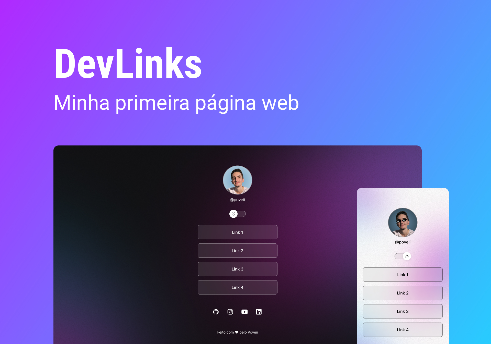

<h1 align="center"> DevLinks </h1>

  Projeto desenvolvido durante o curso DevLinks da <a href="https://www.rocketseat.com.br/">Rocketseat</a>.

  <a href="#-tecnologias">Tecnologias</a>&nbsp;&nbsp;&nbsp;|&nbsp;&nbsp;&nbsp;
  <a href="#-projeto">Projeto</a>&nbsp;&nbsp;&nbsp;|&nbsp;&nbsp;&nbsp;
  <a href="#-layout">Layout</a>&nbsp;&nbsp;&nbsp;|&nbsp;&nbsp;&nbsp;
  <a href="#-versão-anterior">Versão Anterior</a>&nbsp;&nbsp;&nbsp;|&nbsp;&nbsp;&nbsp;
  <a href="#memo-licença">Licença</a>

  

 

  

## 🚀 Tecnologias

Esse projeto foi desenvolvido com as seguintes tecnologias:

- [React](https://reactjs.org/)
- [Node e NPM](https://nodejs.org/)
- [Vite](https://vitejs.dev/)
- [ESLint](https://eslint.org/)

## 💻 Projeto

O DevLinks é um site que organiza todos os meus contatos, redes sociais e links importantes, além disso, tem dark e light mode e bem diferente do curso, foi construído em ReactJS e ViteJS com a adição do ESLint ao projeto.

[Veja o site aqui ←](https://poveii-devlinks.netlify.app/)

## 🔖 Layout

Você pode visualizar o layout do projeto através [DESSE LINK](https://www.figma.com/community/file/1187422022288947321/duplicate). É necessário ter conta no [Figma](https://figma.com) para acessá-lo.

## 🔙️ Versão Anterior

No começo da minha jornada como desenvolvedor, eu criei um site com o mesmo propósito em um evento também da Rocketseat, que por sinal o projeto também era chamado de **DevLinks**, foi na Maratona Explorer 2.

E naquela época eu tinha um **desejo forte**, coisa que eu ainda tenho, de poder fazer dos meus projetos algo que as pessoas possam usar, então não liguem pra várias tarefas não completadas.

[Veja aqui o projeto anterior ←](https://github.com/Poveii/devlinks/tree/vanillajs)

## :memo: Licença

Esse projeto está sob a licença MIT.

---

Feito com ❤️ by Poveii
